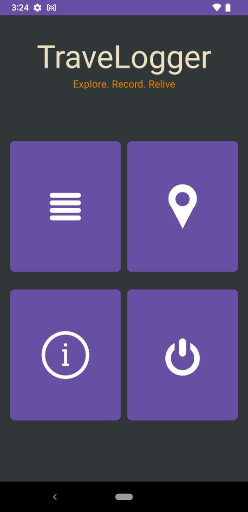
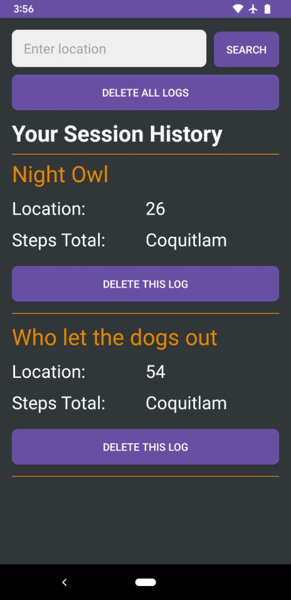

## TraveLogger

TraveLogger is an Android app built in Android Studio for tracking walking sessions while traveling.
It records your step count and current location for each session, then saves that data to a session
history list you can review later.

### Features

- Start and finish a walking session with step counting.
- Track path/location on map during session.
- Save each session with a custom title.
- View, search, and delete saved session logs.
- Open weather search for your current location.

### Permissions Used

- Activity recognition (step sensor)
- Location (map + weather lookup)

Microphone/voice features are currently disabled.

### Screenshots

